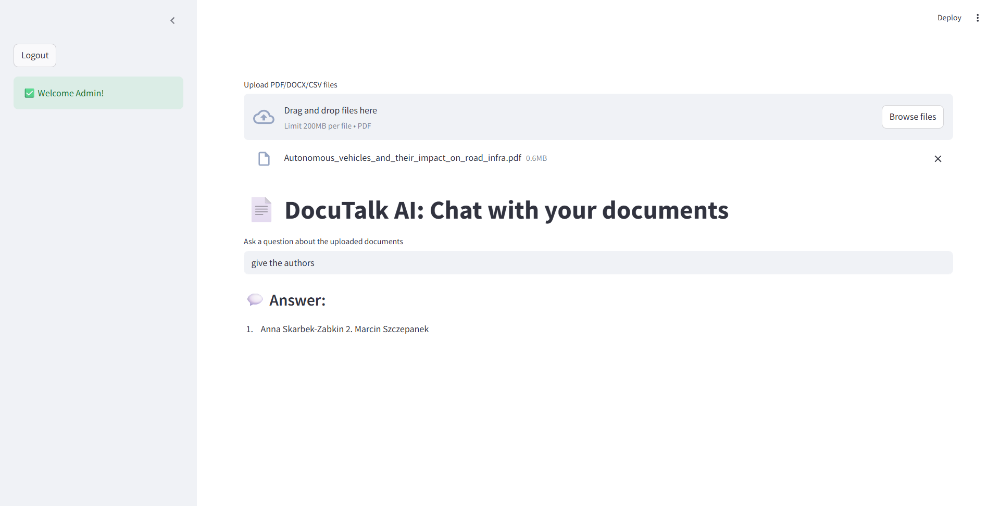

# 📄 DocuTalk AI

Chat with your PDF documents using RAG (Retrieval-Augmented Generation) and Hugging Face LLMs.

## ✅ GitHub Repository Structure

```
DocuTalk-AI/
├── app/
│   ├── main.py                  # Streamlit entry point
│   ├── chatbot.py               # Generates answers via LLM
│   ├── file_uploader.py         # Handles PDF upload and text extraction
│   ├── user_auth.py             # Streamlit-authenticator-based login
├── data/
│   └── Autonomous_vehicles_and_their_impact_on_road_infra.pdf
├── langchain_pipeline/
│   ├── __init__.py
│   └── rag_chain.py             # Loads RAG prompt template and chain
├── retriever/
│   ├── __init__.py
│   ├── doc_splitter.py          # Splits documents into chunks
│   ├── embedder.py              # Embeds text chunks with SentenceTransformers
│   └── faiss_store.py           # FAISS-based similarity search
├── .streamlit/
│   └── config.toml              # Streamlit UI settings
├── .env                         # Secrets: ADMIN_USERNAME, ADMIN_PASSWORD, HF_TOKEN
├── Dockerfile                   # Containerization setup
├── requirements.txt             # All dependencies
└── README.md                    # Documentation
```

---

## 🔍 Features

- 🔐 Admin login with secure Streamlit authentication
- 📤 Upload PDFs and extract text (via PyPDF2)
- 🧠 Retrieve answers using:
  - Document chunking
  - Sentence embedding with SentenceTransformers
  - FAISS vector similarity search
  - Mistral-7B via HuggingFace API
- 💬 Ask natural language questions and receive context-aware answers

---

## 🚀 Setup Instructions

### 1. Clone this repository

```bash
git clone https://github.com/priyabarman2024/DocuTalk_AI.git
cd DocuTalk-AI
```

### 2. Install dependencies

```bash
pip install -r requirements.txt
```

### 3. Create `.env` file

```env
ADMIN_USERNAME=admin
ADMIN_PASSWORD=admin123
HF_TOKEN=your_huggingface_api_token
```

### 4. Run Streamlit App

```bash
streamlit run app/main.py
```

---

## 📁 Upload Support

* ✅ PDF documents only (max 200MB)
* ✅ Extracts text from all pages

---

## 🧠 LLM Configuration

Using [Mistral-7B-Instruct-v0.3](https://huggingface.co/mistralai/Mistral-7B-Instruct-v0.3) via Hugging Face's hosted API.

---

## 📦 Technologies Used

* Streamlit
* LangChain
* SentenceTransformers
* FAISS
* Hugging Face Inference API
* PyPDF2
* dotenv


---

## 📷 Preview



---

## 🐳 Docker Support

```bash
docker build -t docutalk-ai .
docker run -p 8501:8501 docutalk-ai
```

---

## 👩‍💻 Author

**Priya Barman**  
🔗 [Kaggle Profile](https://www.kaggle.com/priyabarman2024)

---

## 📝 License

MIT License
